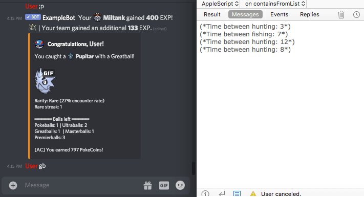

# Simple AppleScript Bot Example

While many are moving to JXA, AppleScript has benefits to offer as well. With this bot it is shown how to extract data from a browser and parse it to generate commands for a simple text-game playing bot.

## Limitations of AppleScript (and JXA)

When accessing data from Safari (buggy) or Chrome, you are limited to the native functions of the browser. Custom functions injected in the console, addons or AppleScript will not be available. However standard functions can dump text to access from the script.

AppleScript also does not support Asynchronous functions so a pulse loop is used instead.

## Notes

The purpose of this script is simply to show how one can access browser data with AppleScript or JXA and use it to return logic. This script does not access private APIs and does not bypass security measures implemented by the game creators. Nevertheless using this for anything other than educational purposes will likely upset someone.

If you intend to make a fully automated bot in this manner you may as well write it entirely in the browser or python. You'll need to hook directly into the APIs anyway to deal with Captchas.

## How to Use

You must configure the bot name variables as well as customize the user name if it is different than the registered user name in the application. Apply the chrome.js script to your browser, and then run the AppleScript. Outside of that the bot should Just Work™

Keep in mind you'll want to monitor the script as it is only semi-automatic and will stall on a human challenge.

## License

The contents of this repository are covered under the [GPL License](LICENSE).